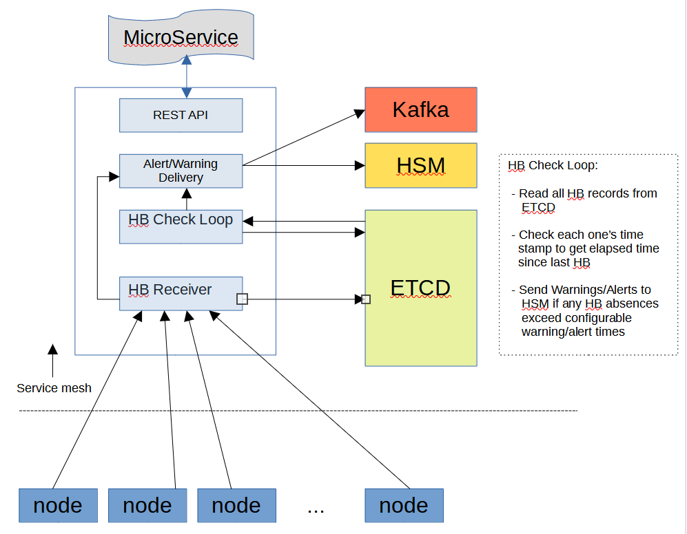

# Heartbeat Daemon (HBTD) Theory Of Operation

The heartbeat daemon receives heartbeats from components and tracks the
time between them.   The heartbeats come from nodes primarily, but can come
from any intelligent component.  For the purposes of this document, only
nodes will be addressed as that is currently the only use case.

There are 2 timeouts utilized.  One is a *warning* timeout and one is an *alert*
timer.  Both timeouts are used to measure how long it's been since the
reception of the last heartbeat.   If the warning timeout is exceeded, then
HSM is notified of a warning condition -- the node "might be dead", and
the node is left in the READY state but the WARNING flag is set on the
node.  If the alert timeout is exceeded, then HSM is notified of an alert 
condition -- the node is "declared dead" and put into STANDBY state with
an ALERT flag.



## Method of Tracking

HBTD is a stateless replicated microservice.  In order for any replica to be
able to function autonomously and without regard to other replicas, the 
heartbeat information is stored in ETCD.

Heartbeats are sent to the */heartbeat* endpoints in the HBTD API.  
Heartbeats sent by components are load balanced by the Kubernetes network, 
so they are delivered to the HBTD replicas in a round-robin fashion.

Upon receipt of a heartbeat, HBTD looks up the heartbeat record for that 
node in ETCD.  If no record exists, one is created and a **Heartbeat
Started** notification is sent to HSM.   The time of the heartbeat arrival is 
recorded and the record is stored in ETCD.  

HBTD employs a periodic heartbeat audit.   During this audit, all ETCD records
are read in as a list.  For each record, the heartbeat's time stamp is compared
to the current time, and if the warning or alert timeouts are exceeded, a 
notification is sent to HSM.

The warning and alert timeouts can be changed on the fly using HBTD's
*/params* API.  Using a PATCH operation, the values of *Errtime* and *Warntime*
can be modified and will immediately become the new time measurement values.

### Dealing with HSM Communication Issues

If there are issues with the system (one of many causes), HBTD's communication
with HSM may lag or have errors.  

HBTD attempts to keep track of the most current heartbeat state of the nodes
it's tracking while communication with HSM is not working.

This is done by utilizing maps of components to heartbeat state changes --
HB started, HB stopped/warning, HB stopped/error, and HB restarted.   The maps
are an interim storage of HB state changes.

In the event that HB state changes can't be conveyed to HSM for a time, these
maps continue to be updated.   The maps contain a monotonically increasing
sequence count for each heartbeat state change encountered.  Thus, if state
changes start to pile up due to HSM issues, a node can have more than one
heartbeat state change.

Whenever the heartbeat audit is done, these maps are "collapsed" so that the
heartbeat state change with the biggest sequence number is the one sent to HSM.

Thus, the last heartbeat state change to occur during an HSM outage is the one
that ultimately gets sent to HSM.   This keeps HBTD from sending multiple
state changes for the same node which would cause lots of thrashing.

## HSM Notifications

There are 4 notifications sent to HSM:

1. **Heartbeat Started**  This indicates a heartbeat has started for the first
   time, from HBTD's point of view.  The node is put into READY state with an 
   OK flag.

2. **Heartbeat Stopped, Might Be Dead**  This sends a notification to HSM 
   putting the node into READY state but with a WARNING flag.

3. **Heartbeat Stopped, Declared Dead**  This sends a notification to HSM
   putting the node into STANDBY state with an ALERT flag.

4. **Heartbeat Restarted**  This indicates that a node that had stopped
   heartbeating has started once again.  The node is put into READY with
   an OK flag.

## REST API

The REST API is described and specified in the swagger file located in 
api/swagger.yaml in this repo.

## Runtime Parameters

As mentioned above, HBTD has adjustable runtime parameters, which can be
changed via a PATCH operation to the */params* API.  The parameters are:

```bash
Debug         Debug logging level.  Default is 0.
Errtime       Elapsed time from last heartbeat indicating an 
                 alert/dead condition
Warntime      Elapsed time from last heartbeat indicating a 
                 warn/sick condition
Interval      Time interval in seconds between heartbeat audits
Sm_retries    Number of retries to attempt when contacting HSM
Sm_timeout    Max number of seconds between HSM retries
SM_url        URL of HSM API
Use_telemetry Non-zero values cause telemetry to be used, 0 == no telemetry.
```

There are also parameters that are read-only at runtime, but are visible for
informational purposes:

```bash
Kv_url          Key/value URL, e.g. http://cray-hbtd-etcd.client:2379
Nosm            Do not contact HSM for any reason (testing only)
Port            HTTP Port for HBTD to respond to
Telemetry_host  Specification of telemetry host, e.g. <ipaddr>:port
```

## Future Enhancements

To improve scaling, it may be necessary to switch from using *ETCD* as the 
backing store to using *memcached*.  ETCD has more persistence than is 
needed, at the expense of speed.  Memcached is **much** faster and is 
persistent enough for HBTD's use.


